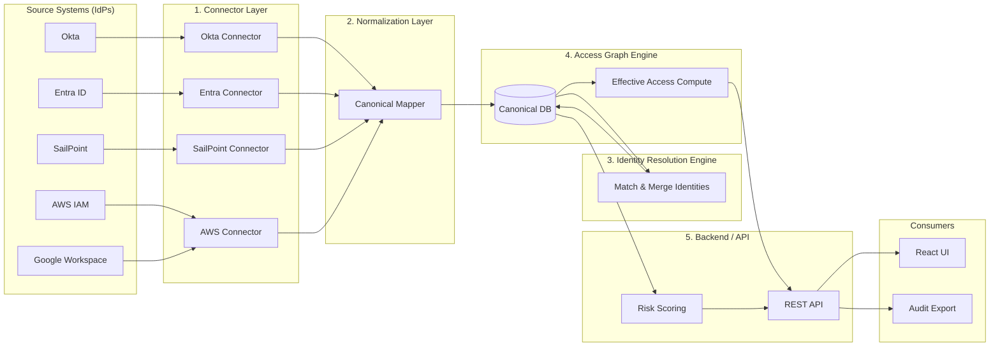
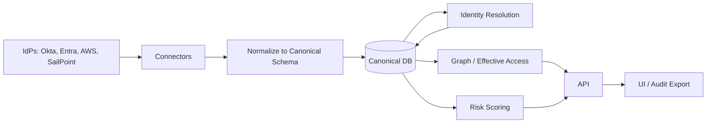

# Identity Observability Platform — Data Flow

This document describes how data moves from source systems into the Unified Identity Graph and out to the UI and risk engine. Use the Mermaid diagram below in docs or Mermaid Live; use the **Excalidraw guide** to redraw the same flow in Excalidraw.

---

## High-Level Data Flow (Mermaid)

---

## Same Flow — Left-to-Right (Simplified)

---

## Layer Responsibilities

| Layer | Purpose | Key outputs |
|-------|--------|-------------|
| **1. Connector** | Read-only, incremental pull from each IdP; rate-limit aware, idempotent writes | Raw or semi-normalized entities (users, groups, roles, memberships) |
| **2. Normalization** | Map vendor-specific objects → canonical Identity, Group, Role, Permission; keep source_system + source_id | Rows in canonical tables |
| **3. Identity Resolution** | Match users across systems (e.g. employee_id, email); link to one canonical identity | identity_sources; merged view of “one person” |
| **4. Access Graph Engine** | Store relationships; compute paths (User→Group→Role→Permission) and materialize effective access | Effective permissions, lineage paths |
| **5. Backend / API** | Serve identities, lineage, risk; run risk rules; generate audit bundles | REST API for UI and export |
| **Consumers** | Unified Identity Profile, Explainability View, Admin Heatmap, Audit Export | Dashboards, PDF/CSV |

---

## How to Draw This in Excalidraw

Use this as a checklist so the data flow matches the architecture.

1. **Left: Source systems**  
   - One box per source: **Okta**, **Entra ID**, **SailPoint**, **AWS IAM**, **Google Workspace**.  
   - Group them in a large container: “Source Systems (IdPs)”.

2. **Connector layer**  
   - One box per connector: **Okta Connector**, **Entra Connector**, etc.  
   - Arrows: each IdP box → its connector.

3. **Normalization**  
   - One box: **Canonical Mapper** or “Normalization Layer”.  
   - Arrows: all connectors → Canonical Mapper.

4. **Canonical store**  
   - One box (or database icon): **Canonical DB (PostgreSQL)**.  
   - Arrow: Canonical Mapper → Canonical DB.

5. **Identity Resolution**  
   - One box: **Identity Resolution Engine** (Match & Merge).  
   - Arrows: Canonical DB → Identity Resolution → Canonical DB (loop).

6. **Graph / Risk**  
   - Two boxes: **Effective Access Compute**, **Risk Scoring**.  
   - Arrows: Canonical DB → both.

7. **Backend**  
   - One box: **REST API**.  
   - Arrows: Effective Access + Risk Scoring → REST API.

8. **Consumers**  
   - Two boxes: **React UI**, **Audit Export**.  
   - Arrows: REST API → both.

Use a clear left-to-right or top-to-bottom flow so “data source → connector → normalization → graph/risk → API → UI/export” is obvious at a glance.
